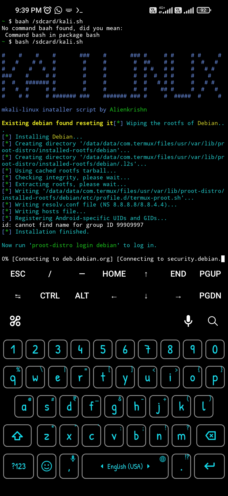

# kalilinux
> This script will install debian and convert it to kali linux and add default user kali on your termux enjoy kali in less than 50mb



# Installation
> just copy and paste bellow command in your termux 
* Note indian user must connect VPN
```
curl -O https://raw.githubusercontent.com/Anon4You/kalilinux/main/installkali && bash installkali
```

## Follow me on Instagram
* [Alienlrishn](https://www.instagram.com/alienkrishn/") 
