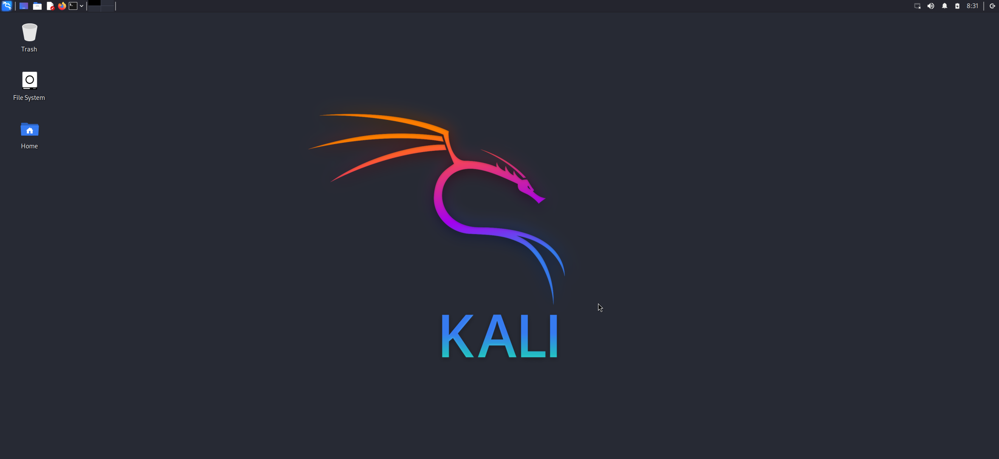

# Kali Linux on Termux 
> This script will install debian and convert it to kali linux and add default user kali on your termux enjoy kali in less than 50mb



# Installation
> just copy and paste bellow command in your termux 
* Note indian user must connect VPN
```
curl -sSL https://raw.githubusercontent.com/Anon4You/kalilinux/main/install.sh | bash
```
## Fixes 
* Added user kali ✅
* Pulseaudio sound fix ✅
* Kali Linux full Desktop ✅
* Works on Termux-X11 ✅
* Added new sources of kali ✅
* Fixed cannot open shared object file: No such file or directory ✅

## Watch more from me 
* [YouTube](https://www.youtube.com/@alienkrishnorg) 
