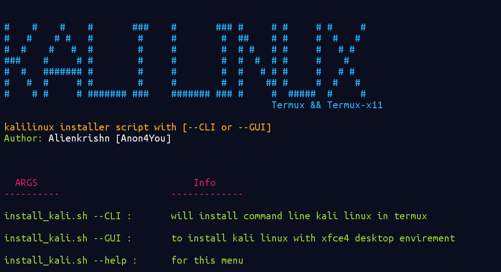

# Kali Linux Installer for Termux 🐧

This repository provides a simple Bash script to install Kali Linux on Termux, enabling users to run either a command line interface (CLI) or a graphical user interface (GUI) version. The script automates the setup process and ensures all necessary dependencies are installed efficiently. 

## Direct install
- command-line `bash <(curl -sL is.gd/alienkrishn_kalilinux) --CLI`
- Gui-installation `bash <(curl -sL is.gd/alienkrishn_kalilinux) --GUI`

## Screenshot 📸

<details>
<summary>Click to view the screenshot</summary>

<p align="center">
  
</p>

</details>

## Features ✨

- **CLI Installation**: Quick setup for a command line version of Kali Linux.
- **GUI Installation**: Install a graphical Xfce desktop environment.
- **Easy Usage**: User-friendly command-line options for installation type selection.
- **User Creation**: Automatically sets up a user for accessing the Kali environment.
- **Environment Setup**: Configures necessary repositories and dependencies for smooth operation.

## Requirements ✅

- [Termux](https://termux.com/)
- Internet connection

## Installation 🚀

To get started, clone this repository and navigate to the directory:

```bash
git clone https://github.com/Anon4You/kalilinux.git
cd kalilinux
```

Make the script executable:

```bash
chmod +x install_kali.sh
```

## Usage 🛠️

Run the script using one of the following options:

### CLI Installation

For the command line version, execute:

```bash
./install_kali.sh --CLI
```

### GUI Installation

For the graphical version, execute:

```bash
./install_kali.sh --GUI
```

### Help

To get help and usage information, run:

```bash
./install_kali.sh --help
```

## Post Installation 🖥️

- To log into the Kali environment after installation, execute:

```bash
kalilinux
```

- For GUI installations, make sure to download the Termux-X11 app from the [official repository](https://github.com/termux/termux-x11/releases/tag/nightly).

## Run kali desktop on termux-x11

- Execute `kalilinux` in termux and login into kali shell then,
run:
```bash
x11-start
```
- open your termux-x11 app 

## Issues ❗

If you encounter any issues, please report them on the [GitHub Issues page](https://github.com/Anon4You/kalilinux/issues/new).

## Contribution 🤝

Contributions are welcome! Feel free to fork the repository and submit pull requests for enhancements or additional features.

## License 📜

This project is licensed under the MIT License. See the [LICENSE](LICENSE) file for more details.

## Author ✍️

**Alienkrishn** (Anon4You)

---

Enjoy your Kali Linux experience on Termux! 🌟
