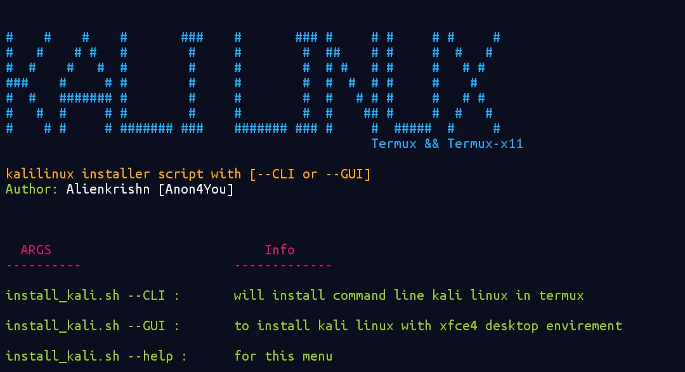

# Kali Linux Installer for Termux (proot-distro)

[](LICENSE)
[](https://termux.com)
[](https://www.kali.org)

A simple Bash script to install **Kali Linux (rolling) with an XFCE4 desktop** on Termux using `proot-distro`. It survives the systemd-under-proot postinst failures that break naive installs.

## Installation

Run this in Termux (no root required):

```bash
bash <(curl -sL is.gd/alienkrishn_kalilinux)
```

Or clone this repo and run the script directly:

```bash
git clone https://github.com/Anon4You/kalilinux
cd kalilinux && bash install_kali.sh
```

## What it does

**On the Termux host** (`pkg`):
- Installs `proot-distro`, `x11-repo`, `termux-x11-nightly`, `dbus`, and `pulseaudio`

**Inside the container**:
- Installs the `kali-rolling` rootfs via `proot-distro`
- Creates user `kali` with password `kali` and full sudo access
- Installs XFCE4 desktop (`kali-desktop-xfce`), Xwayland, and PulseAudio
- Patches systemd postinst failures (shims `systemctl`, `udevadm`, etc.)
- Wires X11/audio env and creates a `kalilinux` launcher

## Screenshot

<details>
  <summary>Click to view the screenshot</summary>

  

</details>

## Usage

1. Install the **Termux:X11** app from https://github.com/termux/termux-x11/releases
2. Start the app, then run:
   ```bash
   kalilinux
   ```
3. Inside Kali, start the desktop:
   ```bash
   startxfce4
   ```

The launcher starts `termux-x11` + PulseAudio and logs you in as `kali` (password: `kali`). `DISPLAY=:1` is set automatically.

## Options (env overrides)

| Env variable | Default | Description |
| --- | --- | --- |
| `DISTRO` | `kali-rolling` | proot-distro name to install |
| `KALI_USER` | `kali` | Desktop user to create |
| `KALI_PASS` | `kali` | Password for that user |
| `FRESH` | `0` | Set to `1` to wipe + recreate the distro first |
| `DESKTOP_PKGS` | `dbus-x11 xwayland xfce4-terminal kali-desktop-xfce pulseaudio` | Desktop packages to install |

Example:

```bash
FRESH=1 KALI_PASS=changeme bash install_kali.sh
```

## Uninstall / reset

```bash
proot-distro remove kali-rolling   # or: proot-distro reset kali-rolling
rm $PREFIX/bin/kalilinux
```

## Maintained by [Alienkrishn](https://github.com/Anon4You)